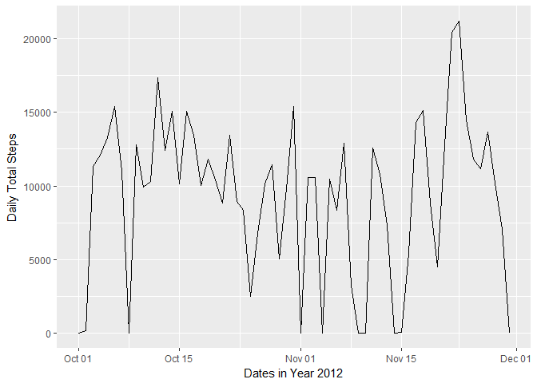

# Reproducible Research: Peer Assessment 1


## Loading and preprocessing the data

Unzip the "activity.zip" file and read the "activity.csv" file.

```r
unzip("activity.zip")
activity <- read.csv("activity.csv")
```

Convert `date` into Date Format

```r
activity$date <- as.Date(as.character(activity$date),'%Y-%m-%d')
```


---------------------

## What is mean total number of steps taken per day?

### Plot daily total steps taken

```r
dailySteps <- tapply(activity$steps, activity$date, sum, na.rm = TRUE)

library(ggplot2)
ggplot() + aes(unique(activity$date),dailySteps) + geom_line() + xlab("Dates in Year 2012") + ylab("Daily Total Steps")
```

<!-- -->


### Calculate mean daily steps

```r
meanSteps <- mean(dailySteps, na.rm = T)
medianSteps <- median(dailySteps, na.rm = T)
```
* Mean Daily Steps 9354.2295082  
* Median Daily Steps 10395  

-----------------

## What is the average daily activity pattern?


## Imputing missing values


## Are there differences in activity patterns between weekdays and weekends?
