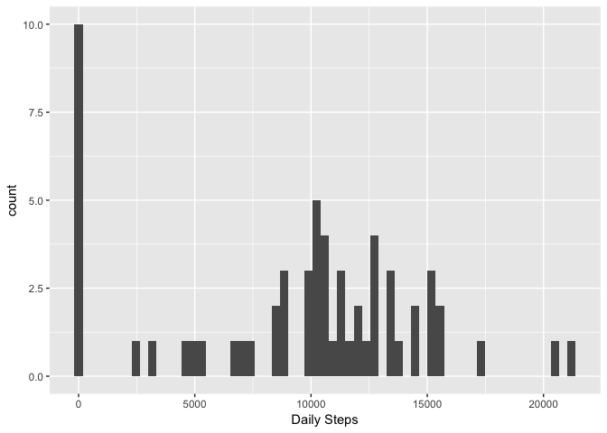
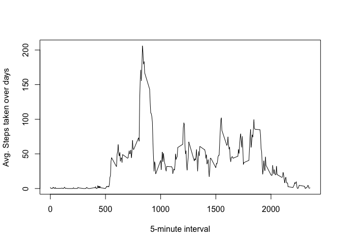
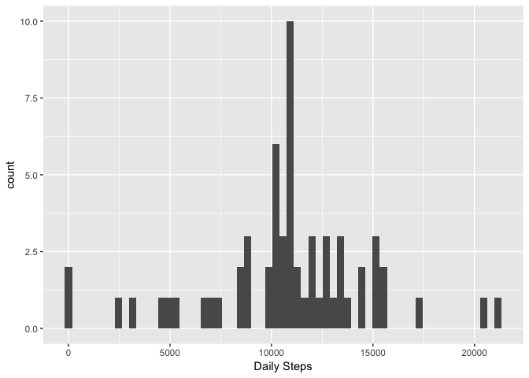
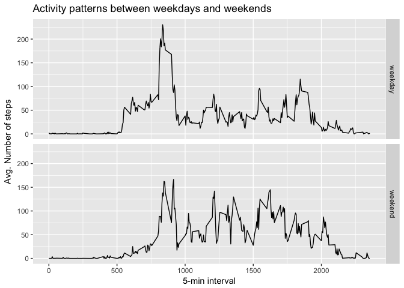

# Reproducible Research: Peer Assessment 1


## Loading and preprocessing the data

Unzip the "activity.zip" file and read the "activity.csv" file.

```r
unzip("activity.zip")
activity <- read.csv("activity.csv")
```

Convert `date` into Date Format

```r
activity$date <- as.Date(as.character(activity$date),'%Y-%m-%d')
```


---------------------

## What is mean total number of steps taken per day?

### 1. Calculate daily steps


```r
dailySteps <- tapply(activity$steps, activity$date, sum, na.rm = TRUE)
```

### 2. Plot daily total steps taken


```r
library(ggplot2)
numBins <- max(activity$date) - min(activity$date) + 1
qplot(dailySteps, bins=numBins, xlab = "Daily Steps")
```

<!-- -->


### 3. Calculate mean and median daily steps

```r
meanSteps <- mean(dailySteps, na.rm = T)
medianSteps <- median(dailySteps, na.rm = T)
```
* Mean Daily Steps 9354.2295082  
* Median Daily Steps 10395  

-----------------

## What is the average daily activity pattern?

###1. Time Series plot of the 5-minute interval and the average number of steps taken, averaged across all days 


```r
avgStepsTimeInterval <- tapply(activity$steps, activity$interval, mean, na.rm=TRUE)
plot(unique(activity$interval), avgStepsTimeInterval, type = "l", xlab = "5-minute interval", ylab = "Avg. Steps taken over days")
```

<!-- -->


###2. 5-minute interval which contains the maximum number of steps


```r
maxAvgStepTimeInterval <- names(avgStepsTimeInterval)[which.max(avgStepsTimeInterval)]
```

* 5-minute interval which has the maximum number of steps is 835.

---------------


## Imputing missing values

###1. Find missing values and impute missing values


```r
numMissing <- sum(is.na(activity$steps))
# Impute missing values with mean of 5-minute interval
filledActivity <- activity
filledActivity$steps[is.na(filledActivity$steps)==TRUE] <- avgStepsTimeInterval[as.character(filledActivity[is.na(filledActivity$steps), 3])]
```


###2. Plot histogram of total steps per day and calculate mean and median


```r
dailySteps <- tapply(filledActivity$steps, filledActivity$date, sum, na.rm = TRUE)
qplot(dailySteps, bins=numBins, xlab = "Daily Steps")
```

<!-- -->

```r
meanSteps <- mean(dailySteps, na.rm = T)
medianSteps <- median(dailySteps, na.rm = T)
```
* Mean Daily Steps 1.0766189\times 10^{4}  
* Median Daily Steps 1.0766189\times 10^{4}  

Both mean and median daily steps has increased after imputing the values.  

-----------


## Are there differences in activity patterns between weekdays and weekends?

Plot line graph to show activity in weekdays and weekends

```r
#Create a new variable for week type (weekday/weekend)
filledActivity$dayType <- ifelse(weekdays(filledActivity$date, abbreviate = T) %in% c("Mon","Tue","Wed","Thu","Fri"),"weekday","weekend")
filledActivity$dayType <- as.factor(filledActivity$dayType)

#Generate plot
library(plyr)
stepsDayByDaytype <- ddply(filledActivity, .(interval, dayType),summarize, steps=mean(steps))

ggplot(stepsDayByDaytype) + aes(interval, steps) + geom_line() + facet_grid(dayType~.) + labs(x="5-min interval", y="Avg. Number of steps",
         title="Activity patterns between weekdays and weekends")
```

<!-- -->
